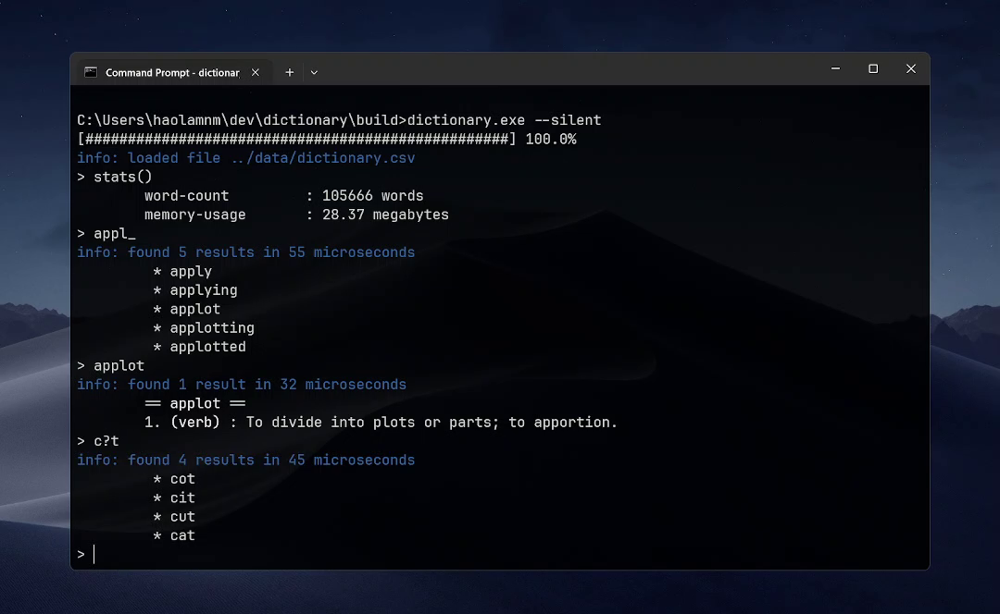

# The Dictionary



A terminal-based dictionary app that combines a Trie and a BK-Tree to support fast word lookups and typo suggestions.

## Overview

In the prior course, I emailed my lab lecturer to ask what else I should learn outside of the syllabus. She advised me to build a dictionary app with a Trie. Following dicussions, I decided to add a BK-Tree with Levenshtein distance to handle typo recommendations.

While working on this, I learned about `std::unique_ptr` and `std::shared_ptr`, which helped me resolve many pointer-related issues. I also figured out how to write some unit tests with [**gtest**](https://github.com/google/googletest).

## Words data

As for the words, I scraped some from [**this website**](https://www.bragitoff.com/2016/03/english-dictionary-in-csv-format/) and [**this repo**](https://github.com/jnoodle/English-Vocabulary-Word-List), and I used [**dictionaryapi.dev**](https://dictionaryapi.dev/) to fetch some missing meanings.

## How to Run

I use [**Ninja**](https://ninja-build.org/) to build my project. Once it’s built, you can run the `build/dictionary.exe` file.

```bash
cmake -G "Ninja" -B build -S .
cmake --build build
```

## Notes

I wrote down some extra stuff in the [**docs**](docs/document.md) folder. It's nothing fancy, just a few notes about the commands and patterns that the app supports.

Have a nice day!
